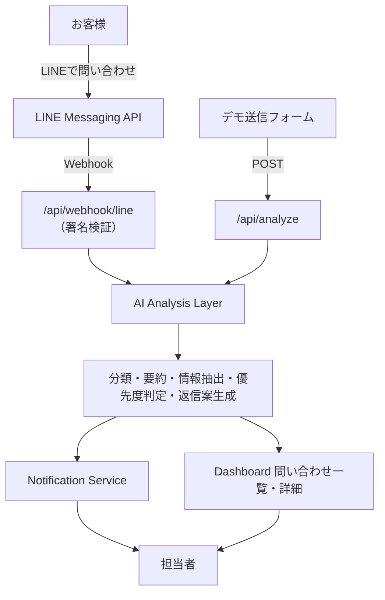

# AI LINE Inquiry Assistant

**店舗に届くLINEの問い合わせを、AIが自動で整理する業務効率化ツールのデモです。**

お客様から届いたメッセージを AI が「分類 → 要約 → 情報抽出 → 優先度判定 → 返信案作成」まで自動処理し、
店舗スタッフは整理済みの内容を確認するだけで対応できる状態にします。

> このリポジトリはポートフォリオ用のデモアプリです。
> **API キーが無くても動作します**（デモモード）。実際のLINEアカウント・顧客データには接続していません。
> 画面に表示される問い合わせはすべて架空のものです。

---

## 概要

飲食店・美容室・小売店・車屋・不動産・介護／医療など、**店舗型ビジネス全般**で利用できる想定の
LINE問い合わせ整理ツールです。特定業種に依存しない汎用のカテゴリ・データ構造で設計しています。

| | 内容 |
| --- | --- |
| 何をするツールか | LINEに届いた問い合わせをAIが整理し、担当者がすぐ対応できる状態にする |
| 誰のためのツールか | LINEで問い合わせを受けている店舗の経営者・スタッフ |
| デモの起動条件 | `npm install` → `npm run dev` のみ（APIキー不要） |

## 解決する課題

店舗のLINE問い合わせ対応には、次のような負担があります。

- 予約・在庫・料金・クレームなどが**すべて同じトーク画面に混ざって届く**
- 忙しい時間帯に来た問い合わせを**見落とす・返信が遅れる**
- 「いつ・何名・どの商品」といった**必要な情報を毎回読み返す**必要がある
- 返信文を**毎回ゼロから考える**手間がかかる
- 誰が対応中なのか**スタッフ間で分からない**

本ツールは、届いた問い合わせを AI が自動で整理し、
**「何の問い合わせか」「どれくらい急ぎか」「何を返せばよいか」** を一目で分かる形にします。

## 主な機能

| 機能 | 説明 |
| --- | --- |
| 問い合わせの自動分類 | 予約 / 営業時間 / 商品・サービス / 在庫 / 料金 / キャンセル・変更 / クレーム / その他 の8分類 |
| 要約 | スタッフが一読で状況を把握できる短い要約を生成 |
| 情報抽出 | 希望日時・人数・対象の商品／サービス・補足情報（子ども連れ等）を抽出 |
| 優先度判定 | 高 / 中 / 低 の3段階。クレーム・当日対応・至急表現は「高」と判定 |
| 返信案の生成 | 担当者が確認して送信する前提の下書きを自動生成（コピー可能） |
| 担当者通知 | 通知処理を共通インターフェース化。Slack / Email / LINE / Discord へ拡張可能 |
| 対応状況の管理 | 未対応 / 対応中 / 対応済み をワンクリックで切り替え |
| ダッシュボード集計 | 今日の問い合わせ件数・未対応件数・高優先度件数・対応済み件数 |
| デモ送信 | 画面上のフォームから問い合わせを模擬送信し、AI解析の流れをその場で体験できる |

## 利用イメージ

**入力（お客様からのLINEメッセージ）**

```
明日の19時に4人で予約できますか？子どもが1人います。
```

**出力（AIによる解析結果）**

| 項目 | 結果 |
| --- | --- |
| 問い合わせ分類 | 予約 |
| 要約 | 明日 19:00に4名で予約を希望。子ども1名を含む。 |
| お客様の意図 | 明日 19:00に4名で予約したい |
| 希望日時 | 明日 19:00 |
| 人数 | 4名 |
| 対象の商品・サービス | 未取得 |
| 追加情報 | 子ども1名 |
| 対応優先度 | 高（直近の日時が指定された予約のため） |

**返信案**

```
お問い合わせありがとうございます。
明日 19:00・4名様でのご予約について、ただいま空き状況を確認しております。
確認が取れ次第ご連絡いたしますので、少々お待ちくださいませ。
```

> 本文から読み取れない項目は推測せず「未取得」「なし」と表示します。
> AI が顧客情報を創作しない設計です。また、営業時間・在庫・料金・空き状況などの
> 店舗ごとに異なる事実は返信案の中で断定せず、「確認して折り返す」形に統一しています。

## 処理フロー



現在のデモモードで実際に流れているのは **デモ送信フォーム → /api/analyze → Dashboard** の経路です。
LINE 経由の経路については「[LINE / 外部API の現状](#line--外部api-の現状)」を参照してください。

## 使用技術

- **Next.js 16**（App Router）
- **React 19**
- **TypeScript**（`strict`、`any` 不使用）
- **Tailwind CSS v4**
- **ESLint**（`eslint-config-next`）
- 外部UIライブラリ・状態管理ライブラリ・アイコンライブラリへの依存なし（追加依存ゼロ）

## デモモード

APIキーを一切設定しない状態が「デモモード」です。

- AI 解析は **Mock AI（ルールベースの解析エンジン）** が担当します
- 担当者通知は **デモ通知**（画面に通知記録を残すのみ・外部送信なし）になります
- 初期表示される6件の架空問い合わせも、同じ Mock AI で解析した結果を表示しています
- 画面上部に「現在の構成」を常時表示し、どのエンジン・どの通知方式で動作しているかが分かります

Mock AI は次の処理をルールベース（キーワード辞書＋正規表現）で行います。

| 処理 | 実装 |
| --- | --- |
| 分類 | カテゴリ別キーワード辞書の重み付きスコアリング |
| 日時抽出 | 今日／明日／明後日／M月D日、`19時`・`19時半`・`19:00`・午後表現に対応 |
| 人数抽出 | `4人` / `4名` / `4名様`。子どもの人数は総人数と区別して補足情報へ |
| 商品抽出 | 商品名の名詞辞書＋色・サイズなどの属性表現 |
| 優先度 | クレーム＞至急表現＞当日希望＞直近の予約・変更＞その他 の順で判定し、判定理由も返す |
| 返信案 | カテゴリ別テンプレートに抽出済みスロットを差し込み |

## セットアップ

```bash
git clone https://github.com/aicmode/ai-line-inquiry-assistant.git
cd ai-line-inquiry-assistant
npm install
npm run dev
```

http://localhost:3000 を開くとダッシュボードが表示されます。**環境変数の設定は不要です。**

```bash
npm run lint    # ESLint
npm run build   # 本番ビルド
npm run start   # 本番サーバー起動
```

## 環境変数

すべて任意です。未設定でもアプリは完全に動作します（デモモード）。
`.env.example` をコピーして `.env.local` を作成してください。`.env.local` は Git 管理対象外です。

```bash
cp .env.example .env.local
```

| 変数 | 用途 | 未設定時の挙動 |
| --- | --- | --- |
| `AI_PROVIDER` | `mock`（既定）または `openai` | `mock` として扱う |
| `OPENAI_API_KEY` | OpenAI API キー | **自動的に Mock AI へフォールバック** |
| `OPENAI_MODEL` | 使用モデル（既定 `gpt-4o-mini`） | 既定値を使用 |
| `OPENAI_BASE_URL` | Azure OpenAI / プロキシ利用時のみ | `https://api.openai.com/v1` |
| `LINE_CHANNEL_SECRET` | Webhook の署名検証に使用 | Webhook は `503` を返す（他機能は正常動作） |
| `LINE_CHANNEL_ACCESS_TOKEN` | LINEへの返信用（**返信機能は未実装**） | 未使用 |
| `SLACK_WEBHOOK_URL` | 担当者通知の送信先 | デモ通知（外部送信なし） |

## LINE / 外部API の現状

未実装の機能を「実装済み」と見せないため、現状を明記します。

| 項目 | 状態 |
| --- | --- |
| デモ送信フォームからのAI解析 | ✅ 実装済み・動作確認済み |
| Mock AI による分類・要約・抽出・優先度・返信案 | ✅ 実装済み・動作確認済み |
| ダッシュボード（一覧・詳細・対応状況・集計） | ✅ 実装済み・動作確認済み |
| `/api/webhook/line` の受信と**署名検証（HMAC-SHA256）** | ✅ 実装済み。ローカルで正しい署名／不正な署名／署名なしの3ケースを検証済み |
| OpenAI プロバイダー（`AI_PROVIDER=openai`） | ⚠️ 実装済み。**実APIキーを持たないため、実際の OpenAI API への接続は未検証**（ローカルのスタブサーバーで成功時・失敗時の経路のみ確認） |
| Slack 通知（`SLACK_WEBHOOK_URL`） | ⚠️ 実装済み。**実際の Slack への送信は未検証** |
| LINE 実環境での Webhook 疎通 | ❌ 未検証（LINE公式アカウント未接続） |
| LINE への自動返信（reply API） | ❌ 未実装。返信案の生成までを行い、送信は担当者が行う想定 |
| 解析結果の永続化（DB） | ❌ 未実装。状態はブラウザのメモリ上のみで、リロードすると初期状態に戻る |
| ユーザー認証・複数店舗対応 | ❌ 未実装 |

Webhook は署名検証を通過したイベントを解析・通知しますが、**保存先が無いため Dashboard には反映されません**
（レスポンスでも `"persisted": false` を返します）。

## セキュリティ

Public Repository として公開する前提で、以下を徹底しています。

- **APIキー・トークン・シークレットをコードに一切書かない。** すべてサーバー側の環境変数からのみ読み込み
- `.env` / `.env.local` などは `.gitignore` 済み。`.env.example` **のみ**をコミットし、値はすべて空またはダミー
- `*.key` / `*.pem` / `secrets.json` / `credentials.json` / `*.sqlite` / `*.db` / `/data/` も `.gitignore` 済み
- リポジトリ内に**実在の企業名・人物名・電話番号・メールアドレス・顧客データを含めない**。デモデータはすべて架空
- APIキーはクライアントへ渡さない（`NEXT_PUBLIC_` 接頭辞は未使用）。AI解析・通知はすべてサーバー側で実行
- LINE Webhook は**署名検証に成功したリクエストのみ**を処理
- デモ送信フォームの入力はサーバーへ送って解析するのみで、**保存もログ出力もしない**
- 通知が実際に外部送信されていない場合は、画面上で「デモ通知」と明示（実送信を装わない）

## 今後の拡張

- 解析結果の永続化（PostgreSQL / Supabase など）と問い合わせ履歴の検索
- LINE Messaging API の reply / push 対応（返信案をワンクリック送信）
- Slack / Email / Discord への実通知と、優先度に応じた通知先の出し分け
- 業種別テンプレート（飲食店向け・美容室向けなど）の切り替え
- 店舗ごとの営業時間・在庫・料金マスタを参照した、より具体的な返信案の生成
- スタッフアカウントの認証と担当者アサイン
- 対応時間・件数のレポート機能

## ディレクトリ構成

```
src/
├── app/
│   ├── api/
│   │   ├── analyze/route.ts          # 問い合わせ解析 + 担当者通知
│   │   └── webhook/line/route.ts     # LINE Webhook 受信（署名検証つき雛形）
│   ├── layout.tsx
│   └── page.tsx                      # ダッシュボード（サーバーコンポーネント）
├── components/
│   ├── dashboard/                    # 一覧・詳細・解析結果・返信案・通知・デモ送信
│   └── ui/                           # Badge / Card / Icons
├── hooks/
│   └── useInquiries.ts               # 問い合わせ状態管理（UIから業務ロジックを分離）
└── lib/
    ├── ai/
    │   ├── index.ts                  # プロバイダー解決とMockフォールバック
    │   ├── types.ts                  # AIProvider インターフェース
    │   ├── mock/                     # ルールベースのデモAI（分類・抽出・要約・返信案）
    │   └── openai.ts                 # OpenAI API 実装
    ├── inquiries/                    # ドメイン型・ラベル・デモデータ
    ├── line/                         # Webhook 型定義・署名検証
    └── notifications/                # 通知サービス（demo / slack）
```

## ライセンス / 注意

本リポジトリはポートフォリオ用のデモです。LINE は LINEヤフー株式会社の登録商標です。
本アプリは同社が提供・承認するものではなく、公式ロゴ・商標素材は使用していません（UIはすべて独自制作）。
